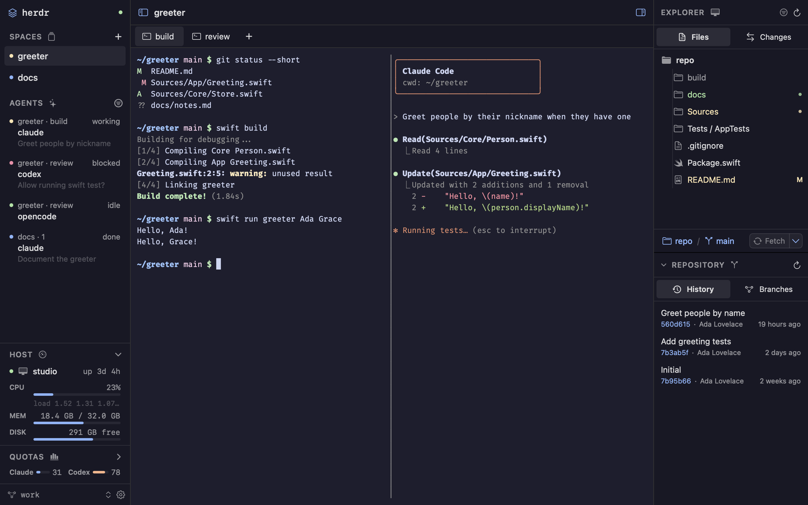

# wooloo

[](https://github.com/rarce/wooloo/actions/workflows/ci.yml)
[](LICENSE)

**A native macOS home for your coding agents.**



wooloo is a Mac app for [Herdr](https://herdr.dev/), the server that runs and organizes coding agent sessions. It is for developers who work with several agents at once, use a mouse alongside the keyboard, and want some of the convenience of an IDE without leaving an environment built around their agents.

Herdr keeps owning the processes, layout and terminal state, so the same sessions stay available from the Herdr TUI. wooloo renders them natively and sends your input back.

wooloo is an independent project, not affiliated with or endorsed by Herdr, Anthropic or OpenAI.

> **Status:** early development. Expect rough edges and breaking changes. See [`TODO.md`](TODO.md) for known issues and planned work.

## Features

### Agents and sessions

- Spaces, tabs and split panes follow Herdr's [workspace, tab, pane and agent model](https://herdr.dev/docs/concepts/). Create, rename, close and zoom them from the sidebar, tab row, context menus, menu bar or command palette.
- The Agents section shows every agent with its Space, tab, summary and status, and can be filtered to the selected Space.
- Alerts when an agent finishes or needs input: Herdr's sounds, in-app toasts or system notifications, with unread marks until you look at the pane.
- The connected host's CPU, memory, disk and uptime, local or over SSH.
- Optional Claude Code and Codex plan usage in the sidebar (see [Agent quotas](#agent-quotas)).
- A session picker for any Herdr session on the machine.
- Remote access to the Herdr session over SSH, through a Cloudflare Tunnel (see [Remote access](#remote-access)).

### Terminal

- Live terminal surfaces over Herdr's binary client endpoint: colors, text attributes, cursor, alternate-screen apps and Herdr's inline PNG and RGB images, drawn with Core Text at Herdr's frame rate.
- Direct typing with control and option chords, paste, and dropped file paths. Mouse clicks, drags and the wheel reach programs that enable mouse reporting.
- Drag split borders to resize panes, select and copy text, and Command-click links.
- Herdr's prefix (`ctrl+b` by default) and direct key bindings, read from and edited in the same `config.toml`.

### Files and editor

- An explorer for the selected Space, local or on an SSH machine saved in Herdr. It works like Zed's project panel: compact folder chains, Git status colors, ignored files, keyboard navigation, multi-selection, drag and drop, in-place create and rename, trash, and undo and redo of file operations. Folders with more than 200,000 files are listed only up to that count, and Go to File says so.
- Go to File (⌘P) with fuzzy matching and `:line:column`, and a command palette (⇧⌘P) for app, editor and explorer actions.
- Editor tabs built on [CodeEditSourceEditor](https://github.com/CodeEditApp/CodeEditSourceEditor): syntax highlighting, find and replace, Git change bars beside line numbers, conflict-checked atomic saves, and Zed-style multiple cursors (⌥-click, ⌘D, ⇧⌘L, ⌥⌘↑/↓).
- Reopen a Space with its document tabs, order, active editor, selections and scroll position. Unsaved edits and untitled drafts are backed up locally under `~/Library/Application Support/wooloo`, including SSH documents, and restored without saving them into the project. Backups are written after a short pause while editing and completed before quitting; closing a dirty tab still asks before discarding its contents.
- Markdown preview with Mermaid diagrams, and Jupyter notebooks rendered with their saved output.
- Native image previews for PNG, JPEG, GIF, WebP, HEIC/HEIF, AVIF, TIFF, BMP, and ICO in local and SSH Spaces, using macOS decoders. Includes zoom, fit, actual size, pixel dimensions, transparency checkerboard, and reload; each tab keeps its zoom and position. Previews are read-only, limited to 50 MiB, and decode at most 4096 pixels per side. Multi-frame images show their first frame.
- Native PDF previews for local and SSH files up to 50 MiB, with page navigation, zoom, page/width fitting, text search (⌘F and ⌘G), password unlocking, and reload. Each tab keeps its page and zoom. PDF previews and form fields are read-only; search uses existing PDF text rather than OCR.
- Project-wide search and replace.

### Git

- A Changes tree with stage checkboxes, a branch bar and a commit editor.
- Unified or split diffs with syntax colors.
- Repository History (with each commit's files and diffs), branches, and worktrees: add a worktree from a branch, or remove one with Git's normal check that refuses dirty worktrees.

### Settings

- Guided sections for Herdr's terminal defaults, worktrees, appearance, notifications, headless size and shortcuts, plus a full TOML editor. Saving validates with `herdr config check`, refuses to overwrite outside changes, and reloads the running session.
- One theme shared by the interface, editor and terminals, with adjustable text sizes.

## Agent quotas

> **Unofficial.** This section uses Claude Code's and Codex's own sign-ins against endpoints that Anthropic and OpenAI do not document for third-party apps. It is not endorsed by either company, may conflict with their terms, and can stop working at any time. Use it at your own risk.

The QUOTAS section is off until you turn it on. Once on, every two minutes while a window is active, wooloo:

- reads Claude Code's sign-in from `~/.claude/.credentials.json`, or else from the Keychain item `Claude Code-credentials` (macOS asks you to allow wooloo the first time);
- reads Codex's sign-in from `${CODEX_HOME:-~/.codex}/auth.json` and the rate limits in its newest session logs;
- sends those tokens to the usage endpoints that Claude Code (`api.anthropic.com/api/oauth/usage`) and the Codex CLI (`chatgpt.com/backend-api/wham/usage`) use themselves.

When the explorer points at an SSH machine, wooloo reads that machine's sign-ins (its files, or its Keychain through `security`) instead of this Mac's, and the requests still leave from your Mac. wooloo keeps the tokens in memory only, never refreshes them, and never writes or logs them. Turn the section off from its context menu.

## Remote access

> **This puts your Mac's SSH login on the internet.** Before turning it on, allow only key authentication: add a file such as `/etc/ssh/sshd_config.d/100-keys-only.conf` with `PasswordAuthentication no` and `KbdInteractiveAuthentication no`, then turn Remote Login off and on again.

Settings → Remote Access (also in the command palette) publishes this Mac's SSH server through a [Cloudflare Tunnel](https://developers.cloudflare.com/cloudflare-one/connections/connect-networks/), so an SSH client elsewhere can reach the Herdr session without opening a port. Clients still sign in with SSH, then run Herdr's own commands (`remote-api-bridge`, `terminal session control`).

- Needs `cloudflared` (`brew install cloudflared`) and Remote Login (System Settings → General → Sharing).
- **Quick tunnel**: no Cloudflare account; a new `*.trycloudflare.com` address on every start. Anyone who learns it reaches your SSH login.
- **Named tunnel**: create a tunnel in Cloudflare Zero Trust with a public hostname whose service is `ssh://localhost:22`, then paste its hostname and token (kept in the Keychain, passed to `cloudflared` through its environment). It can sit behind Cloudflare Access, with a service token for clients.
- Other computers connect with `cloudflared` installed: `ssh -o ProxyCommand="cloudflared access ssh --hostname %h" user@host`.
- While the tunnel runs, wooloo also shows a QR code for a companion Android app that is not published yet.
- The tunnel is wooloo's own `cloudflared` process: it stops when wooloo quits, and can start when wooloo opens.

## Privacy

wooloo has no analytics or telemetry. It talks to the Herdr server on this Mac, to SSH machines you saved in Herdr, and over the network only to:

- GitHub, at build time, to download the pinned Herdr binaries and Swift packages;
- your Git remotes, when you fetch, pull or push;
- web images that a Markdown file you preview links to;
- Anthropic's and OpenAI's usage endpoints, when you turn on QUOTAS;
- Cloudflare, when you turn on Remote Access.

## Requirements

- **To run:** macOS 14 or later. Herdr 0.9.3 is included in the app; an existing compatible Herdr installation can also be used. Git and coding agent CLIs are optional, installed separately for their respective features.
- **To build:** macOS 15.6 or later with Xcode 26 (one vendored package needs Swift 6.2).

## Install

Download `wooloo-<version>.zip` from the [latest release](https://github.com/rarce/wooloo/releases/latest), unzip it and move `wooloo.app` to `/Applications`. The build is universal (Apple silicon and Intel).

The app is not notarized yet (it is signed ad hoc), so Gatekeeper blocks the first launch. Either open it once, then go to System Settings → Privacy & Security and click **Open Anyway**, or remove the quarantine flag:

```sh
xattr -dr com.apple.quarantine /Applications/wooloo.app
```

Check the download against the SHA-256 in the release notes (`shasum -a 256 wooloo-<version>.zip`), or build from source below.

## Build and run

```sh
git clone https://github.com/rarce/wooloo.git
cd wooloo
xcodebuild -project wooloo.xcodeproj -scheme wooloo -configuration Debug -destination 'platform=macOS' build
```

The project signs ad hoc ("Sign to Run Locally"), so no developer account is needed. Keep a signature: macOS refuses notification permission to an unsigned app. You can also open `wooloo.xcodeproj` in Xcode and run the `wooloo` scheme on **My Mac**.

The first build downloads the pinned Intel and Apple Silicon Herdr binaries and verifies their SHA-256 hashes. They are cached under `build/herdr/0.9.3` and bundled as a signed universal helper. You can prepare this cache in advance with `sh scripts/bundle-herdr.sh --prepare`; subsequent builds work offline with the package and runtime caches present.

On a fresh install, a setup wizard lets you choose a folder and creates the first Space in an app-managed `wooloo` session. It installs the included Herdr under `~/Library/Application Support/wooloo/runtime/herdr/0.9.3`, so no download, Homebrew, developer tools, or administrator password is needed at runtime. A user launchd job starts the server when wooloo opens and keeps it running when the app quits. It is not registered to start at login. Herdr's normal `config.toml` and named-session storage are used; existing configuration is preserved.

You can instead choose an existing Herdr executable and connect to a running session. **Set Up Herdr…** in the sidebar session picker opens the wizard again. Runtime updates ship with wooloo; a compatible server already running is reused, and setup never stops its panes.

To try the app without touching your main Herdr session, or to run the tests, see [CONTRIBUTING.md](CONTRIBUTING.md).

## Uninstall

The Herdr server that wooloo starts keeps running after you quit wooloo, so your terminals survive. To remove everything:

```sh
# Stop the server (this ends its terminals) and unload its launchd job.
for plist in ~/Library/Application\ Support/wooloo/runtime/services/*.plist; do
  launchctl bootout "gui/$(id -u)" "$plist"
done
# Remove the runtime, document backups and settings, then delete the app itself.
rm -rf ~/Library/Application\ Support/wooloo
defaults delete dev.wooloo.app
# Only if you used a named tunnel in Remote Access:
security delete-generic-password -s dev.wooloo.remote-access
```

Herdr's own configuration (`~/.config/herdr`) is shared with the Herdr CLI and is left in place; the `wooloo` session's data is under `~/.config/herdr/sessions/wooloo` if you want to remove it too.

## Design notes

Research and plans written while building wooloo. They describe how parts work or could work, not features to rely on.

- [Herdr connection](docs/herdr-connection.md): sockets, events and the client endpoint
- [Terminal performance](docs/perf/README.md): pipeline, benchmarks and baselines
- [SwiftTerm evaluation](docs/swiftterm-evaluation.md): why the terminal is drawn natively
- [Git and file editing](docs/git-and-files-research.md): local and SSH implementation
- [Jupyter notebook rendering](docs/jupyter-notebook-rendering.md): how saved notebook output is shown
- [Herdr plugins](docs/herdr-plugins.md): a plan for integrating Herdr plugins; wooloo does not support them yet

## Contributing

Bug reports, ideas and pull requests are welcome. See [CONTRIBUTING.md](CONTRIBUTING.md), and report security issues privately as described in [SECURITY.md](SECURITY.md).

## License

wooloo is released under the [MIT License](LICENSE). It includes third-party software under their own licenses; see [THIRD_PARTY_NOTICES.txt](THIRD_PARTY_NOTICES.txt), also available in the app under wooloo → Third-Party Notices.
