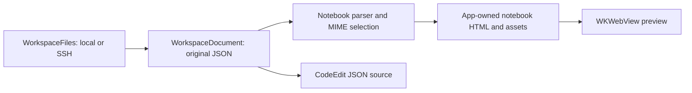

# Jupyter notebook rendering plan

## Scope

xherdr can provide a notebook preview that displays saved code, Markdown, tables, plots, and execution results without starting Python or a Jupyter server. The recommended first implementation is a static `.ipynb` viewer inside the existing document tabs, with a JSON Source mode. Editing individual cells, running kernels, and displaying interactive widgets are separate capabilities with additional requirements.

This research was checked on October 5, 2026 against Jupyter documentation, GitHub's published behavior, Microsoft's public implementations, and xherdr at commit `1d1e840`. Implementation recommendations below are proposals; notebook support has not been added to the app. GitHub's current internal notebook renderer was not inspected, and no browser comparison or rendering benchmark was performed.

## The `.ipynb` document

An `.ipynb` file is a JSON document, not an archive or executable environment. Its root contains `nbformat`, `nbformat_minor`, `metadata`, and an ordered `cells` array. The format major version and the Python `nbformat` package version are different numbers: the current v4 schema includes minor version 5. Notebooks can use languages other than Python. Optional `language_info` and `kernelspec` metadata describe the language and intended kernel; they do not install that environment. See the [notebook format](https://nbformat.readthedocs.io/en/latest/format_description.html).

Cells have a type, source, and metadata. Markdown supplies narrative text; code cells also hold an execution count and saved outputs; raw cells contain material intended for exporters. Multiline string fields may be a string or an array of strings: join arrays with an empty separator, preserving their existing newlines. A MIME bundle offers alternative representations of one result. It is not a sequence of independent results. See the [v4 JSON schema](https://github.com/jupyter/nbformat/blob/4346f97c9d435f41ddfe76d28758b23796fdcf5a/nbformat/v4/nbformat.v4.schema.json).

This small example is an original illustration of a saved result with two display alternatives:

```json
{
  "nbformat": 4,
  "nbformat_minor": 5,
  "metadata": {"language_info": {"name": "python"}},
  "cells": [
    {
      "id": "intro",
      "cell_type": "markdown",
      "metadata": {},
      "source": ["# Report\n", "Saved results from a previous run."]
    },
    {
      "id": "result",
      "cell_type": "code",
      "metadata": {},
      "source": "2 + 2",
      "execution_count": 1,
      "outputs": [
        {
          "output_type": "execute_result",
          "execution_count": 1,
          "metadata": {},
          "data": {"text/plain": "4", "text/html": "<strong>4</strong>"}
        }
      ]
    }
  ]
}
```

The output list preserves the order of distinct results. These four output variants need different handling:

| Output type | Stored information | Display responsibility |
| --- | --- | --- |
| `stream` | `name` and `text` | Show stdout or stderr in order. |
| `display_data` | `data` and `metadata` | Select an available MIME representation. |
| `execute_result` | MIME bundle and execution count | Display the result and its saved count. |
| `error` | `ename`, `evalue`, and `traceback` | Show the exception and traceback. |

The field definitions are in the [output schema](https://github.com/jupyter/nbformat/blob/4346f97c9d435f41ddfe76d28758b23796fdcf5a/nbformat/v4/nbformat.v4.schema.json). Raster images generally contain base64 data; JSON MIME types contain JSON values rather than requiring another JSON string decode. Markdown attachments are cell-local MIME bundles referenced by `attachment:name`. Since format 4.5, cell IDs are required and unique within the document. See [attachments and cell IDs](https://nbformat.readthedocs.io/en/latest/format_description.html#cell-attachments).

A preview represents the stored document. It cannot establish that outputs match the current code, that dependencies remain available, or that running the cells again would reproduce the results. xherdr should describe the view as saved output and keep original execution counts rather than inventing a current execution state.

## GitHub's rendering

GitHub documents `.ipynb` previews as static HTML. JavaScript-based interactive notebook features do not work in repository previews; its documentation points users to nbviewer or a notebook server for those experiences. This establishes a useful initial compatibility target: reading saved content with graceful handling of unavailable output formats. See [Working with Jupyter Notebook files on GitHub](https://docs.github.com/en/repositories/working-with-files/using-files/working-with-non-code-files#working-with-jupyter-notebook-files-on-github).

The 2015 [Jupyter announcement](https://blog.jupyter.org/posts/2015/rendering-notebooks-on-github/) also describes restrictions on dynamic JavaScript, custom CSS, and embedded HTML. These are historical details, not a complete specification of today's sanitizer. GitHub's [January 2022 rendering update](https://github.blog/changelog/2022-01-07-jupyter-notebooks-and-specialized-file-formats-display-faster/) says specialized-file rendering moved primarily into the browser and names several open-source libraries, including nbconvert. It does not document the current notebook-specific pipeline, library versions, or which processing stages run where.

Consequently, it would be inaccurate to assert that today's GitHub notebook previews are simply a server running `nbconvert --to html`, or that a particular JavaScript package reproduces the current implementation. The public behavior is clear; the detailed deployment architecture remains unverified.

### The inspectable conversion reference: nbconvert

Jupyter's Python `nbconvert` offers an inspectable way to understand static notebook export. Its exporter loads a notebook through `nbformat`, applies preprocessors and filters, and uses Jinja templates to produce a target document. The HTML exporter defaults to the `lab` template; a `classic` template is also available. ANSI text conversion is one example of a filter applied to output. The exporter can return HTML in memory, allowing a host to consume it without writing another notebook. See [nbconvert architecture](https://nbconvert.readthedocs.io/en/latest/architecture.html).

Plain HTML export does not require executing cells. Execution is a separately enabled preprocessing operation. For xherdr, an export experiment should consume saved outputs and never add `--execute`. Exported HTML also needs review before being loaded into a privileged application: the checked [HTML exporter](https://github.com/jupyter/nbconvert/blob/1ff189e1b30f0820238e95427c035a9150a5e43f/nbconvert/exporters/html.py) defaults `sanitize_html` to false, defines external script URLs, and prioritizes some active output formats. A safe offline viewer cannot inherit these defaults unchanged.

nbconvert is a useful reference and optional export tool. Requiring a user's Python installation, Jupyter configuration, templates, and packages for every preview would add environment-dependent behavior to xherdr's document viewer.

## VS Code's implementation

VS Code separates notebook support into three extension contracts:

| Component | Responsibility |
| --- | --- |
| `NotebookSerializer` | Convert file bytes to notebook cells and outputs, and serialize edits. |
| `NotebookController` | Execute cells through a selected execution backend. |
| `NotebookRenderer` | Display output items for supported MIME types. |

This separation allows displaying a notebook independently of executing it. Renderers receive output data rather than interpreting the notebook as a Python program. Specialized formats can contribute additional renderer implementations. See the [Notebook API](https://code.visualstudio.com/api/extension-guides/notebook).

The checked [built-in `.ipynb` serializer](https://github.com/microsoft/vscode/blob/9216ae78282dabc1dfd01eca5903a31b43125e28/extensions/ipynb/src/notebookSerializer.ts) decodes bytes, parses JSON, resolves the preferred cell language, and converts the result into `NotebookData`. It rejects notebooks declaring a major version below 4. Its companion [deserializer](https://github.com/microsoft/vscode/blob/9216ae78282dabc1dfd01eca5903a31b43125e28/extensions/ipynb/src/deserializers.ts) converts raster base64 into bytes, translates outputs into notebook output items, and retains cell metadata, IDs, and attachments. Its MIME display ordering prefers specialized formats and HTML ahead of plain text. Those priorities are implementation choices, not requirements imposed on every notebook viewer.

Microsoft's [notebook architecture document](https://github.com/microsoft/vscode/wiki/Notebook-documentation) describes a virtualized cell list with two rendering contexts. Code editing uses the workbench's Monaco text models; Markdown and rich outputs render in a separate webview/iframe. Output dimensions return asynchronously so the outer cell list can adjust layout. Focus can move between editors, the list, and rendered content. That architecture supports a full editor, but brings layout, scrolling, and focus coordination that a first static xherdr preview can avoid.

The checked [built-in output renderer](https://github.com/microsoft/vscode/blob/9216ae78282dabc1dfd01eca5903a31b43125e28/extensions/notebook-renderers/src/index.ts) handles streams, errors, images, text, HTML, SVG, and JavaScript. It gates HTML/SVG and JavaScript rendering on workspace trust. A separate [Jupyter renderer extension manifest](https://github.com/microsoft/vscode-notebook-renderers/blob/b0597bc49a79c363658b40c5006359470ca8647d/package.json) contributes Plotly, Vega/Vega-Lite, and other MIME handlers. Rendering such outputs in VS Code depends on the appropriate renderer and trust state; opening an arbitrary notebook does not guarantee every representation works.

VS Code's user documentation distinguishes opening notebooks from selecting kernels and executing cells, and describes restricted behavior in untrusted workspaces. See [Jupyter Notebooks in VS Code](https://code.visualstudio.com/docs/datascience/jupyter-notebooks). Its serializer and renderer sources are useful architectural references, but their extension APIs, messaging, and workbench integration prevent treating them as drop-in Swift components.

## Current xherdr integration points

The existing document layer already supplies much of the surrounding behavior:

| Existing code | Notebook implication |
| --- | --- |
| [WorkspaceDocumentStore](../xherdr/WorkspaceDocumentStore.swift) | Reuse Space-scoped tabs, preview tabs, document loading, dirty state, and saving. |
| [WorkspaceDocumentView](../xherdr/WorkspaceDocumentView.swift) | Add notebook presentation alongside the source editor, with explicit JSON highlighting for Source mode. |
| [WorkspaceFiles](../xherdr/WorkspaceFiles.swift) | Reuse bounded local/SSH reads, path validation, version hashes, and conflict-aware writes. |
| [MarkdownPreviewView](../xherdr/MarkdownPreviewView.swift) | Reuse theme concepts and Space-relative resource/link resolution, while adapting attachment lookup. |
| [DocumentFind](../xherdr/DocumentFind.swift) | Keep raw JSON search in Source mode and integrate rendered-content search separately. |

`MarkdownDisplayMode.supports` currently recognizes Markdown extensions only. An `.ipynb` file has no notebook-specific model or preview. Opening it follows the ordinary text document path when it fits the file limit. This is independent of Herdr terminal surfaces and plugins; no new Herdr popup or terminal protocol is needed to preview a workspace file.

`WorkspaceFiles.maximumFileBytes` is currently **1,000,000 bytes**. It limits both text reads and saves; Git blob loading also uses it. Embedded image outputs can make notebooks exceed that budget. A notebook preview therefore needs a deliberate format-specific read limit, and editable Source mode needs a matching write policy. Raising only the read limit would create documents users can open but cannot save. Rendering older Git revisions or notebook diffs needs the same budget review.

The vendored [MarkdownView package](../Vendor/MarkdownView/Package.swift) deliberately omits SwiftMath and its fonts, leaving math expressions as plain text. It also includes [HTML rendering through WebKit](../Vendor/MarkdownView/Sources/MarkdownView/Rendering/Shared/HTML/HTMLView.swift), with a content-height observer. That general HTML wrapper is not a notebook-specific resource or trust boundary. Reusing the Markdown view alone would leave math, attachments, MIME selection, and rich-output policy unresolved.

## Rendering options

The following comparison is an engineering assessment for xherdr, informed by the implementations above:

| Approach | Advantages | Main cost or limitation |
| --- | --- | --- |
| SwiftUI/AppKit cells with native Markdown, text, and images | Reuses native components and theme; natural path toward native cell editing. | HTML tables, SVG, math, and specialized plots still need additional renderers; multiple webviews complicate layout and resources. |
| Swift model plus one `WKWebView` for the notebook preview | One scrolling document can display sanitized HTML, images, Markdown, and math; no Python runtime required. | Adds bundled web assets, content policy, resource routing, and find integration; native Markdown styling must be reproduced. |
| nbconvert subprocess followed by a webview | Broad Jupyter export compatibility and familiar templates. | Requires Python dependencies and controlled configuration; generated scripts/resources need sanitization and offline treatment. |
| Embed JupyterLab notebook/rendermime packages | Reuses mature notebook models and MIME rendering. | Larger JavaScript dependency surface and integration work; a complete JupyterLab application is unnecessary for viewing saved results. |

[JupyterLab rendermime](https://jupyterlab.readthedocs.io/en/stable/api/modules/rendermime.html) is particularly relevant as a renderer-registry reference: it handles MIME bundles with renderers for Markdown, HTML, images, and LaTeX. Evaluating an actual bundle and its dependencies would be required before choosing to embed it. Merely including the package name does not provide xherdr's file, theme, or resource integration.

## Recommended first implementation

Use a Swift notebook model and one app-owned `WKWebView` per visible notebook preview. Keep the native document tab and toolbar, and reuse the CodeEdit source editor for raw JSON. This targets GitHub's static saved-output experience while retaining the architectural separation used by VS Code. Avoid a separate webview or editable code editor for every cell in the first version.



### Parsing and document state

Introduce a `NotebookDocument` representation with ordered cells, typed outputs, JSON-valued MIME bundles, metadata, attachments, and version information. Parse off the main thread and associate the result with the document revision. Cancel or discard stale work when the source changes or its tab closes. Render from the in-memory document text so unsaved JSON edits can be previewed without rereading disk.

Support format 4 initially, including older v4 files without cell IDs. Generate presentation identities for those cells without writing them back. Retain the original JSON text as the source of truth, including unfamiliar metadata and output fields. A newer minor version can be displayed on a best-effort basis with diagnostics for unsupported elements; an unsupported major version should offer Source mode with a clear message. Malformed JSON or invalid essential fields should produce a preview error without discarding the source or automatically rewriting the file.

Default `.ipynb` files to **Preview**, with **Source** and **Split** modes comparable to the current Markdown controls. Source mode edits the original JSON. Saving continues through the existing conflict-aware document path. Preview interactions such as collapsing outputs, scrolling, or changing a MIME alternative should be view state and should not mark the notebook dirty. Structured cell edits and a notebook serializer are deferred until a later phase can preserve unknown fields and handle undo reliably.

### Output policy

Define an explicit renderer registry and preference order. Choose one usable representation per rich output, skipping empty, unsupported, or rejected candidates. If the preferred renderer fails, try the next supported representation. Offer available alternatives without duplicating the result. The proposed first-release coverage is:

| Content | First-release treatment |
| --- | --- |
| Markdown cells and `text/markdown` | Render headings, lists, links, code fences, and tables; resolve cell attachments separately from workspace paths. |
| Code cells | Read-only highlighted source, language label, saved execution count, and ordered outputs. |
| Streams and errors | Escaped text, bounded ANSI color handling, traceback display, and expandable long output. |
| `text/html` | Sanitized static HTML, including common dataframe tables. |
| PNG/JPEG and supported raster alternatives | Bounded base64 decoding and image dimensions; fit to the preview width. |
| `image/svg+xml` | Sanitized SVG with active content and external references removed. |
| `text/latex` and Markdown math | Bundled math rendering, with visible source/error fallback for unsupported syntax. |
| `application/json` | Escaped, formatted JSON, including scalar and array values. |
| `text/plain` | Final supported text fallback. |
| Raw cells | Clearly labeled source text; do not inject arbitrary exporter material into the page. |
| JavaScript, widgets, and unknown vendor MIME types | Use a saved supported alternative, otherwise show the unsupported type and allow inspecting its data. |

A reasonable starting preference is sanitized HTML, supported raster images, sanitized SVG, Markdown, LaTeX, JSON, then plain text. This is an xherdr policy to validate against real notebooks, not a claim about GitHub's exact order. For example, a dataframe with HTML and plain-text alternatives should show one table; a Plotly output with a saved PNG alternative should show that PNG without loading Plotly.

### Web assets and resource handling

Candidate bundled components are [markdown-it](https://github.com/markdown-it/markdown-it) for Markdown, [highlight.js](https://github.com/highlightjs/highlight.js) for code, [DOMPurify](https://github.com/cure53/DOMPurify) for HTML/SVG sanitization, and [KaTeX](https://katex.org/docs/options.html) for math. Pin selected releases and retain their licenses and font notices. Check Jupyter math delimiters and macro compatibility in fixtures; a KaTeX implementation should keep `trust` disabled and fall back visibly when syntax is unsupported. These are proposed dependencies, not an inspected GitHub technology stack.

Generate the surrounding HTML and CSS from an app-owned template using xherdr theme and typography tokens. Keep notebook strings out of executable script interpolation; send structured data through a safe argument/serialization path. Run only bundled application scripts. Notebook-authored scripts, event handlers, active URLs, embedded frames, and styles capable of escaping the output presentation should be removed or rejected. CSP, navigation policy, and sanitization must agree; a sanitizer alone does not define a complete resource policy.

Use an [ephemeral WebKit data store](https://developer.apple.com/documentation/webkit/wkwebsitedatastore/nonpersistent()) and a restricted [custom URL scheme handler](https://developer.apple.com/documentation/webkit/wkurlschemehandler) for bundled assets and approved images. Resolve workspace references through `WorkspaceFiles`, including its local/SSH path checks. Attachment names must resolve within their originating cell. Expose registered resource IDs rather than an unrestricted filesystem path endpoint. Do not grant the preview access to the entire Space with a broad `file:` base URL.

The initial viewer should work offline: no CDN imports or automatic HTTP image/resource requests. Show unavailable external resources explicitly. Route user-activated web links to the system browser and valid workspace file links to native document tabs. Restrict any JavaScript-to-Swift messages to narrowly typed preview actions; they must not become a process execution or arbitrary file-read API. Dispose handlers, resource registrations, and outstanding loads when closing or replacing a document.

Jupyter's [trust model](https://jupyter-server.readthedocs.io/en/latest/operators/security.html) checks signatures against a user-owned database before trusting stored active output. A notebook's own metadata is therefore not evidence that xherdr should execute its scripts. The first static viewer needs no trust toggle: sanitize the supported representations and consistently decline notebook-authored JavaScript.

### Limits, performance, and search

Introduce separate notebook budgets for file bytes, cells, individual text outputs, decoded image bytes/pixels, and aggregate resources. A proposed initial file cap is 20 MiB, subject to measurement. Keep ordinary text-file limits unchanged. Bound base64 decoding before allocating image buffers, avoid decoding every output alternative, and show truncation or resource failures locally without losing the rest of the notebook. Offer raw Source only within its supported editor/write budget.

Use one scrolling document, lazy image/output preparation, and revision-based updates. Preserve the cell scroll anchor, selection where practical, and collapsed output state after refresh. Large notebooks may eventually require cell virtualization; measure first-render latency, scrolling, memory, web-content processes, and file descriptors before promising VS Code-scale behavior. A single webview per visible document reduces one source of overhead but does not eliminate image or DOM costs.

Preview Find should search rendered text and navigate between matches; Source Find keeps the current JSON editor behavior. Search results from the workspace should reveal the JSON source initially. Mapping an exact JSON search location into a rendered code cell requires additional source-offset tracking, especially for escaped strings and string arrays, and should be implemented explicitly rather than guessed from cell text.

## Interactive output and execution

Plotly or Vega MIME handlers can be added later as reviewed, bundled renderers. Even without a kernel, such renderers may execute application JavaScript to display saved structured data. That capability needs explicit resource and renderer policies, separate from allowing arbitrary `application/javascript` output.

ipywidgets require more than a MIME string: a widget view references a model, and offline embedding needs saved widget state plus a compatible widget manager and modules. Saved state can support some frontend interactions without Python, while callbacks requiring kernel state need a live kernel. Missing state or unsupported custom modules must produce a fallback rather than a broken empty output. See [Embedding Jupyter Widgets](https://ipywidgets.readthedocs.io/en/stable/embedding.html).

Running cells requires a kernel lifecycle and messaging backend. The [Jupyter protocol](https://jupyter-client.readthedocs.io/en/stable/messaging.html) distinguishes execution requests, IOPub output, stdin, and control messages; outputs must be correlated to the initiating request, and completion includes the appropriate idle state. A future backend also needs interrupt/restart, environment selection, authentication, concurrent requests, output updates, and save semantics. Executing cell text in a Herdr shell pane would not implement these notebook semantics.

For a later local/remote implementation, investigate connecting to a Jupyter Server over its [WebSocket kernel protocol](https://jupyter-server.readthedocs.io/en/latest/developers/websocket-protocols.html), with process ownership and SSH forwarding defined separately. Previewing a notebook fetched over SSH can already happen locally using its saved outputs; it does not require installing Jupyter on either host.

## Implementation order and validation

1. Add the notebook parser, format-specific document budgets, revision handling, and fixtures. Preserve raw JSON and unknown fields; test string/string-array sources and all stored output variants.
2. Add Preview/Source/Split presentation, one restricted notebook webview, bundled assets, MIME fallback, attachments, theme, selection/copy, Find, and clear invalid-file diagnostics.
3. Verify static coverage with saved dataframe tables, raster/SVG plots, math, errors, raw cells, and notebooks from multiple languages. Exercise local and SSH paths, external changes, source edits, save conflicts, closing/reopening, and large-document failure modes.
4. Measure first render, scroll behavior, memory, and resource cleanup. Add output virtualization only where those measurements require it.
5. Consider structured cell editing and lossless serialization, then specific interactive MIME renderers. Evaluate kernel execution as its own project with a defined ownership and trust model.

Fixtures should include older v4 and 4.5 notebooks, missing/duplicate IDs, empty cells, both multiline encodings, JSON scalar outputs, multiple MIME alternatives, damaged image data, cell-local attachments with the same filename, ANSI tracebacks, unsupported formats, and newer minor versions. Malicious HTML/SVG fixtures should verify that opening or previewing a notebook cannot execute its scripts, fetch external resources, or escape workspace path boundaries. UI checks should cover keyboard navigation, accessibility, dark/light themes, resizing, source/preview switching, and search.

Validate unchanged-file round trips at the byte level: opening and previewing must not rewrite anything. When raw JSON is edited, only an explicit save should write it through the existing version check. A future structured editor needs additional round-trip tests for metadata, attachments, unknown output formats, and stable cell identities.

## Research verification

The public documentation was read and these source snapshots were downloaded and inspected: VS Code `9216ae78282dabc1dfd01eca5903a31b43125e28`, VS Code notebook renderers `b0597bc49a79c363658b40c5006359470ca8647d`, nbformat `4346f97c9d435f41ddfe76d28758b23796fdcf5a`, and nbconvert `1ff189e1b30f0820238e95427c035a9150a5e43f`. Links above pin implementation claims to those commits where applicable.

The initial research confirmed xherdr's document flow, one-megabyte read/write limits, existing Markdown/WebKit components, and omitted math dependency. That research stage did not change the app or run a reference exporter because Python validators were unavailable in its interpreter. The subsequent implementation and its validation are recorded below.

## Implemented static preview

The initial implementation uses `NotebookDocument.swift` for a bounded, off-main-thread display projection and `NotebookPreviewView.swift` for one ephemeral WebKit view. `.ipynb` documents open in Preview and share the existing Source/Preview/Split controls. Source edits the original JSON through CodeEdit with JSON highlighting; explicit saves retain the existing local/SSH version checks. Preview interactions do not rewrite the file. Format 4 is supported, including pre-4.5 files without IDs; invalid JSON and unsupported major versions show a recoverable preview error.

The preview displays Markdown, highlighted code, execution counts, ordered stdout/stderr and tracebacks, dataframe HTML, raster images, sanitized SVG, LaTeX, formatted JSON, and plain text. Rich outputs display one MIME representation with a selector for alternatives and fall back when an image fails. Widgets and JavaScript use a saved static alternative or an inspectable unsupported-output notice. Output sections can be collapsed and code can be copied. Native Find searches rendered text in Preview, including collapsed outputs; Source and Split search JSON. Replace switches to Source.

The app bundles markdown-it 15.0.2, DOMPurify 3.4.16, KaTeX 0.19.0 with WOFF2 fonts, and highlight.js 11.12.0. Versions, official npm archive hashes, and licenses are retained in `Vendor/NotebookPreview/`. The preview has no Python dependency and makes no external resource requests. Notebook HTML is sanitized, active elements and author styles are removed, SVG references are restricted and IDs scoped per image; safe SVG presentation styles become attributes to retain plot colors and strokes. Navigation is intercepted, and a nonce-based CSP permits only app scripts. A native custom scheme serves bundled assets and registered raster images. Markdown attachments remain cell-local; workspace images use the existing scoped local/SSH resolver. External links open in the browser only after a click.

Notebook file reads and writes allow 20 MiB; other text formats retain their existing limit. Preview limits are 4,096 cells, 20,000 outputs, and 500,000 characters per text field. Truncation affects only the display. Individual raster images are limited to 16 MiB and 16 million pixels across their frames; the resource handler also imposes a 64 MiB aggregate image budget per render. Images are lazy, but the initial text DOM is not virtualized. Kernels, cell editing, notebook execution, interactive widgets, and semantic notebook diffs remain outside this first implementation.

### Development fixtures

A local Python environment can generate real saved-output notebooks and a sanitized nbconvert reference export:

```sh
python3 -m venv .venv-notebooks
.venv-notebooks/bin/python -m pip install -r scripts/notebook-dev-requirements.txt
.venv-notebooks/bin/python scripts/notebook-fixtures.py
```

The script schema-validates format 4.5 and legacy 4.4 notebooks using nbformat. It produces a normal preview with pandas tables and matplotlib plots, untrusted HTML/SVG, large saved text, invalid JSON, and `reference.html` under `build/notebook-fixtures/`. The environment, matplotlib cache, and generated fixtures are ignored by Git. They are development tools, not application requirements.

To include the generated fixtures in native renderer tests:

```sh
TEST_RUNNER_XHERDR_NOTEBOOK_FIXTURES="$PWD/build/notebook-fixtures" \
  xcodebuild -project xherdr.xcodeproj -scheme xherdr -configuration Debug \
  -destination 'platform=macOS' test
```

The parser and actual WebKit tests cover normalized multiline fields, MIME alternatives, JSON scalars, cell-local attachments, legacy IDs, truncation, invalid raster fallback, Markdown math delimiters, HTML/SVG sanitization, scoped resources, rendered-text Find, and conflict-aware saves. Generated-fixture checks additionally validate pandas tables, matplotlib PNG/SVG output, widget text fallback, untrusted active content, and a notebook larger than the old one-megabyte limit. These optional fixture checks are skipped when the environment variable is absent.

Manual checks against the isolated `xherdr-ui-test` session verified Preview/Source/Split, finding a value inside a dataframe, opening a relative file link in the Space, recovering malformed JSON, previewing unsaved edits, and explicit saving. Comparing files on disk confirmed that previewing does not rewrite notebook bytes and that saving preserves custom metadata. No live SSH notebook UI check was performed; remote files use the existing SSH read/save/resource paths.

The signed Debug build and complete macOS test suite passed with the generated-fixture checks enabled: 582 tests, 3 skipped, 0 failures. Browser assets add approximately 900 KiB before bundle/signing overhead.
